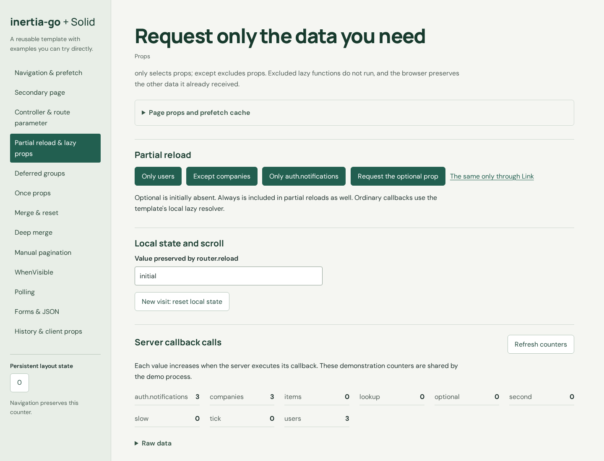

# Inertia Go + Solid Template

**Go on the server. Solid in the browser. One executable in production.**

A reusable, native template with **Fiber v3**, **inertia-go**, **Inertia v3**, **SolidJS**, TypeScript, and Vite. Includes a Laravel-style route registry, controllers with one action per file, an Artisan CLI, and an interactive feature lab that shows what this community integration actually supports.



> [!WARNING]
> This uses community Go and Solid adapters. Compatibility with the official Laravel/React integration is partial. The Solid adapter is a pinned beta, and several features need local helpers. Read the [compatibility notes](#compatibility-and-known-limitations) before choosing this stack.

## Quick start

Requirements: **Go 1.26+**, **Node 22.12+**, and npm. No Docker or external services.

```bash
git clone https://github.com/andreitelteu/inertia-go-solid-template.git
cd inertia-go-solid-template
./artisan install
./artisan dev
```

Open **http://127.0.0.1:8080**. Vite provides Solid HMR; the bundled Node watcher rebuilds and restarts Go when its source changes. Air is not required. Fonts are local.

Choose another address or expose development on your LAN:

```bash
./artisan dev --host 0.0.0.0 --port 8081 --vite-port 5174
```

Optional settings are in [.env.example](.env.example). Environment variables take precedence over `.env`.

### Windows, macOS, and Linux

`./artisan` is a Bash launcher for `go run -buildvcs=false . artisan ...`. Use it on Linux, macOS, or Windows with Git Bash. Native Windows launchers are included:

```powershell
.\artisan.cmd install
.\artisan.cmd dev
# Or, when your PowerShell execution policy permits:
.\artisan.ps1 dev
```

You can also use `go run -buildvcs=false . artisan help` on any supported platform. Go and Node are needed for development/building; the compiled server needs neither.

## Artisan commands

| Command | Purpose |
| --- | --- |
| `./artisan install` | Install npm and Go dependencies |
| `./artisan dev` | Vite HMR and Go rebuild/restart |
| `./artisan build` | Run `npm run build`, then embed the frontend into the Go executable |
| `./artisan start` | Run the built executable in production mode |
| `./artisan start --env demo --port 8081` | Run the compiled interactive lab without Vite |
| `./artisan serve` | Run the current Go entrypoint directly |
| `./artisan make:controller Users --action index_page,show_user` | Create a controller package with separate action files |
| `./artisan make:component UserCard` | Create a Solid component |
| `./artisan make:page Admin/Users` | Create a Solid page, including nested directories |
| `./artisan route:list` | Print methods, paths, and route names |
| `./artisan key:generate` | Write a new session encryption key to `.env` |
| `./artisan test` | TypeScript, embedded build, Go race tests, and Chromium scenarios |
| `./artisan help` | List commands and options |

Scaffolds refuse to overwrite existing files. Register new controllers in `routes/web.go` and new pages in the resolver in `resources/js/app.tsx`; the CLI prints the next steps.

## Single-binary production

```bash
./artisan build
./artisan key:generate
./artisan start
```

The output is `build/inertia-go-solid-template` (`.exe` on Windows). Vite JavaScript, CSS, fonts, and its private manifest are compiled into the executable with `//go:embed`. Static resources are served by Fiber. No `public/build`, Node, npm, or Go installation is needed on the target machine.

Copy the executable and provide a persistent **`APP_KEY` containing 64 hexadecimal characters** through environment variables or `.env`. The binary can run from a directory without the project:

```bash
APP_ENV=production APP_ADDR=0.0.0.0:8080 ./inertia-go-solid-template
```

Production cookies are encrypted, HttpOnly, SameSite, and Secure; use HTTPS at the browser, typically through your reverse proxy. Demo counters and diagnostic endpoints are disabled in production. `--env demo` keeps the lab interactive over local HTTP and uses an ephemeral key unless configured.

The asset version is derived from the Vite manifest. The manifest and hidden asset paths are not publicly served. A production binary always uses its compiled resources, even if an external build directory or Vite URL is present.

Cross-compile after the first frontend build:

```bash
./artisan build --os windows --arch amd64 --output build/template-windows.exe --skip-frontend
./artisan build --os darwin --arch arm64 --output build/template-macos --skip-frontend
./artisan build --os linux --arch amd64 --output build/template-linux --skip-frontend
```

Builds use `CGO_ENABLED=0`. Cross-compilation verifies that a target builds; execution must still be tested on that operating system. CI includes native Linux, Windows, and macOS jobs.

`npm run build` builds **only the frontend**. Use `./artisan build` for the complete executable.

## Interactive feature lab

Each page includes controls, an expandable raw-props view, and explanations. Try:

- SPA navigation, hover/click/mount prefetch, cache expiry/tags, and remembered state;
- partial reloads with `only`, `except`, nested paths, and query evaluation counters;
- deferred groups and loading fallbacks; once reuse, fresh reloads, and eligible navigation;
- merge/deep merge, matching by ID, deduplication, and resets;
- manual scroll pagination, `WhenVisible`, and polling with start/stop;
- `Form`/`useForm`, uploads, validation, 303 redirects, error bags, Precognition, and JSON requests;
- history encryption, client-side prop helpers, lifecycle events, cancellation, and named route parameters.

Data is demonstrative. Forms and uploads do not persist records or files.

## Routes and controllers

```text
main.go                             Artisan and standalone-server entrypoint
artisan / artisan.cmd / artisan.ps1 Cross-platform launchers
internal/artisan/                   CLI, scaffolding, configuration
routes/web.go                       Declarative route registration
internal/router/                    Groups, middleware, names, reverse URLs
app/server/                         Fiber startup and shutdown
app/application/                    Assets, encrypted sessions, Inertia bridge
app/inertia/                        Local lazy-prop helper
app/controllers/
  users_controller/show_user.go     One snake_case file per action
  form_controller/store_form.go
resources/js/
  app.tsx                           Page resolver and bootstrap
  pages/                            Feature demos
  layouts/ components/ lib/         Shared UI and compatibility helpers
resources/css/ resources/fonts/     Styles, local fonts, font licenses
public/                             Production embed implementation
public/build/                       Generated Vite output; ignored by Git
.agents/skills/inertia-go-solid/     Project skill and compatibility matrix
tests/browser/ tests/protocol/      Browser, protocol, and limitation tests
```

A controller is a Go package/folder, rather than a class. Each exported action factory returns a Fiber handler and lives in its own snake_case file. Registration is explicit.

The router supports `Get`, `Post`, `Put`, `Patch`, `Delete`, `.Name(...)`, route groups, middleware, and escaped reverse URLs. `/users/37` demonstrates a named route parameter. Fiber owns the HTTP server; its official adaptor bridges the `net/http` API required internally by inertia-go.

## Compatibility and known limitations

| Area | Supported behavior | Limitation or local adaptation |
| --- | --- | --- |
| Lazy / partial props | `only`, `except`, nested selection, evaluation counters | Plain upstream callback props can return 500. Use the local `Lazy` helper through `RenderPage`; native builder wrappers are opaque to that helper. |
| Merge | Root merge, nested append/prepend, deep merge, ID matching | Native `.Append()` without arguments loses root merge metadata. Use `Merge(...)` for a root merge. |
| Always / shared props | Required props and errors retained in partial reloads | Parent-only `Always` loses nested fields; protected leaves are also wrapped. Shared callbacks remain eager. |
| Validation / error bags | Redirect validation, separate bags, stale-version reflash | Local session/render handling compensates for upstream partial filtering and flattened bags. |
| Flash | Demonstrated flash through props | Upstream uses `props.flash`, rather than the Inertia v3 top-level `page.flash` contract. |
| Infinite scroll | Tested manual pagination using native scroll metadata | The Solid beta's native `InfiniteScroll` fails during initialization. Automatic/reverse scrolling and viewport URL sync are not supplied. Laravel paginator sibling fields are not preserved. |
| JSON HTTP requests | Reactive response displayed by the demo | Native `useHttp.response` is not reactive here; `useHttpResponse` exposes the resolved Promise through a Solid signal. |
| Prefetch inspection | Full URL cache lookup, expiry and tags | Native `usePrefetch` drops query strings; `useCurrentPrefetch` performs full-URL lookup. |
| Once / deferred | Browser-tested reuse, fresh/explicit reloads, groups | Once TTL/alias and wrapper composition have protocol coverage, not complete browser coverage. Parallel request performance is not measured. |
| Precognition | Valid/invalid field checks | The 422 JSON envelope differs from Laravel's `message` and array-of-errors convention. |
| Cancellation | Client cancellation events | Browser cancellation does not guarantee cancellation of a Fiber request or database operation. Use explicit server deadlines. |
| SSR / DevTools | No claimed support | SSR, hydration, and DevTools have not been validated. |

> [!IMPORTANT]
> Test passes describe particular scenarios with the pinned dependencies and local helpers. They do not certify full feature-family compatibility or parity with Laravel/React. Tests asserting known upstream defects also pass; those are limitation checks, not support claims. Dependency caches are not patched.

Authentication, an ORM, route model binding, queues, complete CSRF protection, and persistent upload storage are outside this template. The [24-family compatibility reference](.agents/skills/inertia-go-solid/references/features.md) documents the evidence and remaining gaps in detail.

## Tests and project skill

```bash
npx playwright install chromium
./artisan test
```

The suite exercises the real Fiber server with embedded production assets. Browser scenarios run serially to isolate demo counters; port **8102** must be free. Separate commands: `npm run typecheck`, `npm run test:go`, `npm run test:browser`, and `npm run report`.

See the [verification report](reports/template-verification.md), [project skill](.agents/skills/inertia-go-solid/SKILL.md), and [feature requirements](docs/requirements.md). The skill explains how to extend this stack, use Artisan, and keep compatibility claims tied to tests.

## License

MIT. Bundled fonts retain their respective Open Font License notices in `resources/fonts/`.
